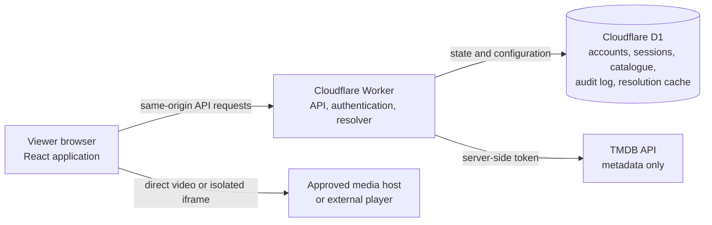
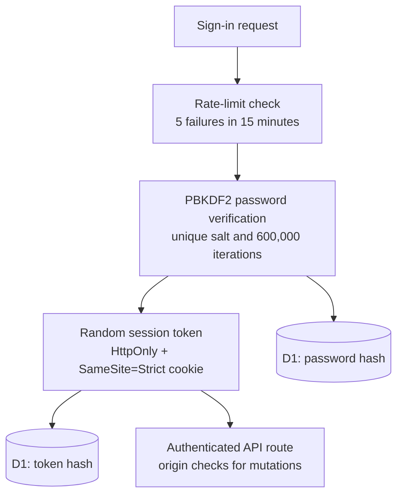
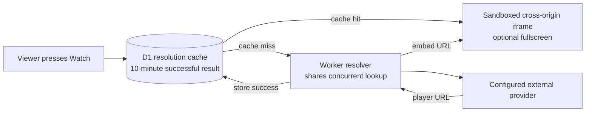

# Fedora Movies: Architecture and Safer Playback

## Executive summary

Fedora Movies is a private, account-based movie and television application built with React, TypeScript, Vite, a Cloudflare Worker, and Cloudflare D1. The browser provides the interface; the Worker owns authentication, administration, favourites, source lookup, and the TMDB metadata proxy. D1 stores account records, password and session hashes, audit events, configured media sources, and short-lived player-resolution cache entries.

The design separates application control traffic from video delivery. Direct authorised media is delivered from the configured media host to the viewer’s browser. Optional external players are opened only after a viewer explicitly presses **Watch** and run in a sandboxed cross-origin iframe. Fedora Movies does not relay video, bypass DRM, or attempt to defeat browser or operating-system protections.

> **Important boundary:** This document describes controls that reduce risk in the Fedora Movies application. It cannot certify an external website, guarantee that an external player is lawful or malware-free, or control that provider’s availability and bandwidth.

## Contents

1. [System architecture](#system-architecture)
2. [Identity, sessions, and administration](#identity-sessions-and-administration)
3. [Playback architecture](#playback-architecture)
4. [Concurrent viewers and reliability](#concurrent-viewers-and-reliability)
5. [Threat model and safeguards](#threat-model-and-safeguards)
6. [Operational safety practices](#operational-safety-practices)
7. [Verification and deployment](#verification-and-deployment)
8. [Limits of the protection model](#limits-of-the-protection-model)
9. [Administrator checklist](#administrator-checklist)

## System architecture

The viewer’s browser sends same-origin API requests to the Cloudflare Worker using a session cookie that browser JavaScript cannot read. The Worker validates the session, uses D1 for application state, and adds the TMDB token only when it calls an allowed TMDB metadata route. Video bytes are deliberately outside the Worker’s path.



The Worker is not a video relay. This is important for both reliability and cost: one viewer’s stream does not occupy application video capacity that another viewer needs.

| Component | Responsibility | Security boundary |
| --- | --- | --- |
| React/Vite client | Renders discovery, account, admin, and player UI; calls same-origin API routes. | Does not contain the TMDB access token or privileged server secrets. |
| Cloudflare Worker | Authenticates, validates actions, proxies TMDB metadata, manages sources, and resolves optional embeds. | Does not proxy the video stream or make a third-party provider same-origin. |
| Cloudflare D1 | Stores hashes, sessions, favourites, audit records, source configuration, and successful resolution cache entries. | Stores password and session hashes, not plaintext passwords or raw session tokens. |
| Media host or external player | Delivers direct video or operates a separate embedded player. | Outside Fedora Movies operational and security control. |

## Identity, sessions, and administration

Authentication is enforced in the Worker rather than hidden only in the client. Viewer passwords use PBKDF2-HMAC-SHA-256 with a unique 16-byte salt and 600,000 iterations. Raw passwords are never retained.

After successful sign-in, the Worker creates a random session token. The browser receives it in an `HttpOnly`, `SameSite=Strict` cookie, while D1 stores only a SHA-256 hash of that token. Viewer sessions last 30 days and administrator sessions last 8 hours. A viewer must change a temporary password before normal application access is granted. Disabling an account or resetting a password revokes its active sessions.



Administrative routes require a separate administrator session. Mutating API routes expect same-origin JSON requests and reject a supplied `Origin` header that does not match the Worker’s own origin. Account and media-source changes are recorded in an audit log.

Worker JSON responses use `Cache-Control: no-store`, `X-Content-Type-Options: nosniff`, `Referrer-Policy: no-referrer`, and a restrictive API Content Security Policy. These headers protect the API response boundary. The static application and any external iframe remain separate browser resources with their own policies.

## Playback architecture

### Direct administrator-approved media

Administrators can associate a direct MP4 or WebM URL with a movie or TV episode and record a rights basis. Signed-in viewers receive only active entries matching the selected media. The browser plays a direct entry with a persistent native HTML5 `<video>` element.

This is the preferred option when the organisation owns or licenses the media because the source host, TLS configuration, media type, codec, and byte-range support can be reviewed before the source is enabled.

### Optional external players

An optional dynamic provider is resolved only after the viewer presses **Watch**. The Worker finds an embed URL and returns it to the browser; it does not proxy the provider’s page or its video stream. The resulting player is rendered in an iframe with a sandbox and narrowly declared playback permissions, including fullscreen for the player’s own user interface.



The iframe is cross-origin with Fedora Movies. Browser cross-origin protections prevent the external frame from reading or changing the parent application’s DOM, cookies, or authenticated API responses. Fullscreen lets the external player expand for usability; it does not make the provider’s code part of the Fedora Movies application.

> **Isolation is not certification.** A sandbox can reduce the capabilities given to an embedded frame, but it is not a malware scanner. Fedora Movies cannot inspect, sanitise, or make a third-party page trustworthy.

## Concurrent viewers and reliability

Each viewer receives an independent browser playback session. There is no application-level playback queue and no shared stream being pushed through the Worker. The shared application work is limited to control traffic such as account checks, catalogue lookup, TMDB metadata, and dynamic-player resolution.

To avoid repeated lookups for a popular dynamic title, successful player resolutions are cached in D1 for ten minutes. If multiple requests for the same source reach the same Worker instance during the first lookup, they share one in-flight resolver request. This reduces outbound resolver pressure and improves startup reliability.

| Situation | Application behaviour | Viewer impact |
| --- | --- | --- |
| Different titles open at once | Requests run independently, subject to normal Worker, D1, and provider limits. | No app-level playback queue. |
| Same dynamic title opens simultaneously | One in-flight resolver request is shared inside the Worker instance. | Fewer duplicate lookups and less startup contention. |
| Same title reopens within ten minutes | D1 returns the previously successful player resolution. | Faster path to the external player and less resolver traffic. |
| External player is slow or unavailable | Resolver timeout and recoverable player error state. | The app remains usable, but video availability depends on the provider. |

This improvement cannot create external streaming bandwidth. If an external provider is overloaded, viewers can still buffer or fail to load because the provider controls the media delivery.

## Threat model and safeguards

The table below separates controls the application directly enforces from risks that remain outside its control.

| Threat or failure mode | Fedora Movies control | Remaining risk |
| --- | --- | --- |
| TMDB token exposed in browser code | The Worker holds the token as a secret and adds it server-side to allowed TMDB requests. | Cloudflare account and Worker secret management still matter. |
| Session theft through page JavaScript | `HttpOnly`, `SameSite=Strict` cookies; D1 stores token hashes only. | Phishing, browser compromise, or endpoint malware can still steal credentials or actions. |
| Repeated password guessing | Throttle after five failures in fifteen minutes; password hashes use PBKDF2. | Distributed attacks and weak user passwords remain possible. |
| Cross-site mutation request | Same-origin validation for non-GET requests and JSON-only mutation bodies. | Protection depends on correct deployment origin and browser behaviour. |
| External player attempts to access app content | Cross-origin, sandboxed iframe rather than app-DOM integration. | The player can still affect its own frame or show unwanted content inside it. |
| Resolver overload for a popular title | Ten-minute D1 cache plus shared in-flight resolution. | Cold-cache surges across Worker instances and provider outages can still occur. |
| Malicious or unlawful third-party content | No technical guarantee; source review and a preference for direct authorised media are required. | External site behaviour is outside the app’s control. |

## Operational safety practices

The technical controls work best with disciplined source and account management.

1. Prefer owned, licensed, or otherwise authorised direct media. Review the source host, HTTPS certificate, media type, codec compatibility, byte-range support, and rights status before enabling it.
2. Treat dynamic providers as optional and higher risk. Review their current behaviour and service terms before enabling them, and disable a provider immediately if it begins redirecting, serving unwanted content, or behaving unexpectedly.
3. Use a long, unique `ADMIN_PASSWORD`. Store it and `TMDB_ACCESS_TOKEN` in Cloudflare secrets or ignored local `.dev.vars`, never in source code or browser-visible `VITE_*` variables.
4. Give every viewer an individual account. Disable expired accounts and revoke sessions after a password reset or suspected misuse.
5. Keep Cloudflare, Node.js, application dependencies, browsers, and operating systems patched. Review Worker logs and the administrative audit log after account or source changes.
6. Distinguish application faults from provider faults. An embedded provider problem usually needs a source change or provider removal; it is not fixed by restarting a viewer’s account session.

## Verification and deployment

The project has Worker/D1 unit tests and browser tests across Chromium, Firefox, Android, iPhone-profile, and iPad-profile coverage. They cover account flows, password changes, administrator actions, source behaviour, player recovery, accessibility, responsive layouts, and the shared resolution cache.

Run these checks before a deployment:

```bash
npm run typecheck
npm run lint
npm test
npm run build
npm run db:migrate:remote
npm run deploy
```

Migration `0004_stream_resolution_cache.sql` creates the shared cache table required for the resolver-performance improvement.

## Limits of the protection model

Fedora Movies can enforce account access, keep privileged credentials server-side, record administrative changes, isolate optional external players from the app shell, and reduce duplicated resolver work. These controls reduce the application attack surface and improve reliability.

The application cannot guarantee that an independent media provider is secure, lawful, or malware-free. It cannot change that provider’s bandwidth, catalog, tracking, ads, redirects, or content decisions. It also cannot protect a compromised browser, operating system, or network. The safest operating position remains: prefer direct authorised media, limit dynamic integrations to reviewed sources, remove unsafe sources quickly, and keep the application and endpoints patched.

## Administrator checklist

| Review area | Administrator action | Evidence to retain |
| --- | --- | --- |
| Source permission | Confirm that the direct source is owned, licensed, public-domain, or otherwise authorised for the intended audience. | Rights basis and approval record. |
| Provider review | For optional dynamic providers, review the domain, playback behaviour, redirects, and current terms before enabling. | Review date, reviewer, and removal contact. |
| Account access | Use individual viewer accounts; disable expired access and revoke sessions after resets or suspected misuse. | Audit-log entry and account status. |
| Secrets and deployment | Keep administrator and TMDB credentials in Cloudflare secrets or ignored local variables; apply D1 migrations before deployment. | Deployment checklist and migration result. |
| Incident response | If an external player behaves unexpectedly, disable it first, record the incident, and direct viewers away from that source. | Incident note, source status, and follow-up owner. |
